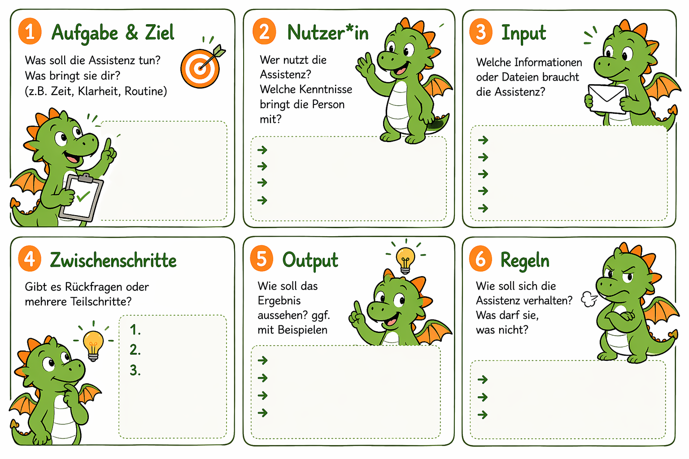

## Was sind KI-Arbeitsprofile?

:::: karten

::: karte
**Assistenzen** sind strukturierte, längere “Unterbots” mit Rollenbeschreibung, Infos, Abläufen und Rückfragen, die dir wiederkehrende Aufgaben abnehmen.

z.B.: *„Du bist Veranstaltungsplaner und hilfst, eine Checkliste zu erstellen. Frage zuerst…“*

> Assistenzen heißen in ChatGPT (Custom)GPTs, bei Gemini Gems, bei Langdock und Copilot Agenten. Sie sind in der Regel nur in kostenpflichtigen Versionen enthalten und werden zunehmend von Skills abgelöst.
:::

::: karte
**Projekte** sind meist als Ordner angelegte Bereiche in KI-Tools, in denen Dateien hochgeladen und Instruktionen gespeichert werden können.

Beispiel: Mein Projekt KI-Lernreise enthält Info-Sheets und Präsentationen und kann darauf basierend kleine Anfragen, wie Mails, Linkedin-Posts oder Konzeptfragen beantworten.

> Projekte sind im kleinen Umfang auch in kostenlosen Lizenzen verfügbar.
:::

::: karte
**Skills** sind konkrete, eher kleine Instruktionen, die für viele Arbeitsprozesse gelten (z.B. Genderregel oder Design einer Vorlage). Sie aktivieren sich selbstständig, wenn Triggerworte auftauchen. Sie werden aktuell Tool-übergreifend ausgerollt.

> Skills sind bisher nur in kostenpflichtigen Versionen verfügbar.
:::

::: rahmenkarte
**Agenten** sind komplexe Systeme, die selber Strategien entwickeln und Tools eigenständig aktiv einsetzen. NUR für Fortgeschrittene und bezahlpflichtig.

Die bekanntesten sind **ChatGPT Work** und **Claude Cowork**. Mehr dazu in meinem Blog-Artikel: [www.juliajunge.de/agentische-ki](https://www.juliajunge.de/agentische-ki)
:::

::::

## Schritt für Schritt zu eigenen Arbeitsprofilen

::: schritte untereinander
1. ### Entdecke Use Cases im Alltag
   Welche Aufgabe wiederholt sich? Was fragen Kolleg*innen dich ständig? Wo denkst du: „Das müsste mir doch KI abnehmen können…“?

2. ### Schreibe einen guten Prompt
   So konkret wie nötig, so kurz wie möglich. Benenne Rolle, Ziel und Aufgabe klar. Nutze das KLARO-Schema. Lasse dir aus guten Chats Infos für Prompts zusammenfassen. Speichere den Prompt in deinem KI-Tool als Assistenz/Skill/Projekt.

3. ### Hinterlege Wissen und Beispiele und integriere Rückfragen
   Was braucht die Assistenz, um gut arbeiten zu können? Wenn die KI auf etwas warten oder nachfragen soll – gib das mit an.

4. ### Testen, teilen, verbessern
   Teste deinen Prompt im Alltag. Verbessere ihn. Teile ihn mit anderen. Verbessere ihn.
:::

::: tipp
**Viele gute Beispiele für Assistenz-Prompts** findet ihr bei Felix Schlenther unter [ai-first.ai/ai-assistenten](https://ai-first.ai/ai-assistenten) (Gratis-Registrierung erforderlich)
:::

::: canvas
## Canvas: So planst du deine Assistenz

:::
