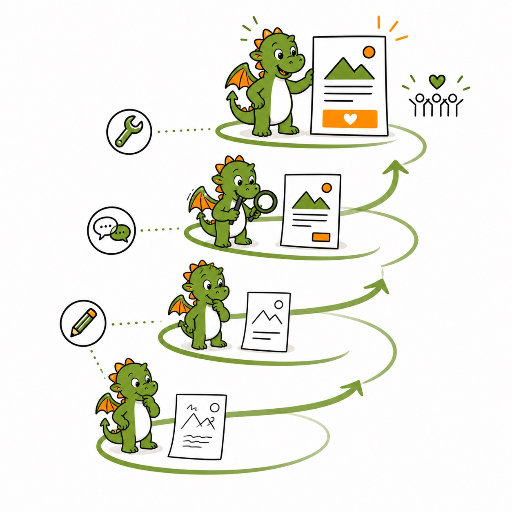

oder ein Lob auf gute Experimente

Denn ob generative KI ein Fluch oder Segen für unsere Arbeit und unsere Gesellschaft wird, liegt an uns.

Hinweise zur Transparenz

Dieser Leitfaden wurde von Julia Junge in ko-kreativer Zusammenarbeit mit KI entwickelt. Feedback und redaktionelle Mitarbeit leisteten Kay Schulze und Alexander Dony.

Ursprünglich erstellt für den Paritätischen Gesamtverband. CC-BY-SA.

<nav class="toc" id="inhalt">
Inhalt
<h2>Artikelübersicht</h2>
<ol>
<li class="toc-einzel"><a href="#einleitung">Zwischen Fear-of-Missing-Out und dem Glauben, dass der Hype einfach vorübergeht</a></li>
<li class="toc-phase"><a href="#phase-a">Phase A: „Einfach“ Anfangen</a>
<ol>
<li><a href="#schritt-1">Schritt 1: Generative KI verstehen lernen</a></li>
<li><a href="#zeitplan">Vorschlag für einen Zeitplan</a></li>
<li><a href="#schritt-2">Schritt 2: KI ausprobieren und sich austauschen</a></li>
</ol></li>
<li class="toc-phase"><a href="#phase-b">Phase B: Strategisch experimentieren</a>
<ol>
<li><a href="#schritt-3">Schritt 3: Bedarfe erkennen, Ziele setzen, Entscheidungen treffen</a></li>
<li><a href="#schritt-4">Schritt 4: Technik anpassen, Daten vorbereiten, Datenschutz dauerhaft sichern</a></li>
<li><a href="#schritt-5">Schritt 5: KI produktiv nutzen</a></li>
</ol></li>
<li class="toc-phase"><a href="#phase-c">Phase C: Organisationsweit ausweiten</a>
<ol>
<li><a href="#schritt-6">Schritt 6: Erfolge und Misserfolge unter die Lupe nehmen</a></li>
<li><a href="#schritt-7">Schritt 7: Ausweiten und neue Standards setzen</a></li>
</ol></li>
<li class="toc-phase"><a href="#bonus">Bonus: Wissen teilen, sich vernetzen und gemeinsam für ethische, sichere und ökologische KI einsetzen</a></li>
</ol>
</nav>

::: tipp
**Ergänzend:** Zu diesem Leitfaden gibt es eine laufend aktualisierte **Leitlinien-Vorlage** für die KI-Nutzung in eurer Organisation: [Zur Leitlinien-Vorlage](https://www.juliajunge.de/leitlinien-ki-nutzung/)
:::

<section class="abschnitt-kopf" id="einleitung">

Einleitung<h2>Zwischen Fear-of-Missing-Out und dem Glauben, dass der Hype einfach vorübergeht …</h2>

</section>

Seit ich Vereine und Organisationen zu Generativer KI berate, höre ich die Fragen: „Wofür sollen wir das denn benutzen?“ und: „Welches Tool ist das beste?“

Die Fragen sind ein großartiger Einstieg in das Thema KI – auch wenn es auf beide keine guten Antworten gibt. Generative Künstliche Intelligenz (und nur um die wird es im Folgenden gehen, auch wenn ich zu KI abkürze) ist **kein Tool, sondern eine Technologie**. Während Zoom dazu dient, Online-Treffen zu machen und Excel dazu, übersichtliche Tabellen zu berechnen, lässt sich Generative KI nicht auf enge Einsatzgebiete beschränken. Ihre Bedeutung für unsere Arbeit ist eher mit der Einführung des Internets vergleichbar. Sie ist eine neue Basistechnologie, die die meisten Bereiche unserer Arbeit verändern wird. Und bei inzwischen über 30.000 generativen KI-Tools ist ein Überblick schon jetzt nicht mehr möglich. Dazu werden KI-Funktionen in immer mehr unserer alltäglichen Tools (wie Zoom, Padlet, Office etc.) integriert.

Ebenso oft höre ich: „Wir brauchen eine KI-Strategie, bevor wir anfangen.“ Das halte ich für falsch. Generative KI ist eine Technologie, die in den Kinderschuhen steckt, sich ständig entwickelt und die so vielseitig ist, dass es nie die eine Art geben wird, sie „richtig“ zu benutzen. Genauso wenig, wie wir zu Beginn des Internets vorhersehen konnten, wozu wir heute benutzen, können wir das jetzt schon für KI sagen. Erst monatelang einen schlechten, schon bei Verabschiedung überalterten Plan zu machen, bedeutet viele verschwendete Ressourcen.

„Ok“, höre ich einige denken, „aber sollten wir dann nicht einfach abwarten?“ Auch hier mein klares Nein. Warum sollten wir ein großartiges Werkzeug, das uns jetzt schon einiges leichter macht, liegen lassen, bis es noch ein bisschen besser ist? Und wichtiger: **Wie sollen wir die Technologie verstehen, wenn wir nicht anfangen, sie zu nutzen?** Wie sollen wir etwas über ihre Potentiale und Risiken lernen? Wie sollen wir ein Gespür dafür erhalten, was wir auch politisch an Rahmenbedingungen für einen sicheren, ethischen und ökologischen Einsatz fordern sollten, ohne sie jetzt auszuprobieren?

Mein Votum ist klar: ==Wir sollten die aktuelle Zeit nutzen, um uns einzuarbeiten, Anwendungsfälle zu entwickeln und Forderungen zu stellen für unsere Entlastung im Alltag UND für die politischen Rahmenbedingungen der Zukunft.== Denn ob generative KI ein Fluch oder Segen für unsere Arbeit und unsere Gesellschaft wird, liegt an uns.

## Agil statt Strategie

Statt lange Strategien zu entwickeln, empfehle ich deshalb, **agil anzufangen**. Lasst uns mit KI anfangen und allen Mitarbeitenden und Ehrenamtlichen, die Lust haben, einen guten Rahmen schaffen, damit sie die Möglichkeiten, Grenzen und Fallen erkunden und eigene Anwendungsmöglichkeiten finden und erfinden.

Dazu braucht es wenige grundsätzliche Leitlinien und Einführungsschulungen; dazu mehr in den ersten beiden Kapiteln. Denn das Ziel ist es, zunächst schnell ins Tun und Lernen zu kommen.

Um dann auch ohne Strategie eine hohe Qualität zu erreichen, ist agiles Arbeiten in Schleifen organisiert. Das heißt: Anfangen und auswerten, besser weitermachen und erneut auswerten, Funktionierendes ausweiten und immer wieder auswerten und anpassen. Dieses Vorgehen werde ich hier in 7 plus einen Bonus-Schritt erläutern und mit Checklisten und Fragen für alle Schritte ausführen.

<a href="#phase-a">Phase A · Schritt 1–2<strong>„Einfach“ Anfangen</strong></a>
<a href="#phase-b">Phase B · Schritt 3–5<strong>Strategisch experimentieren</strong></a>
<a href="#phase-c">Phase C · Schritt 6–7<strong>Organisationsweit ausweiten</strong></a>
<a href="#bonus">Bonus<strong>Wissen teilen, sich vernetzen</strong></a>

Nicht alles wird für alle Organisationen passen – aber das wisst ihr selbst. Nehmt, was hilfreich ist und passt das andere an. In jedem Fall wünsche ich euch Mut zum Ausprobieren und natürlich ganz viel Spaß und Erfolg.

Eure Julia

<section class="phase" id="phase-a">

Phase A · Schritt 1–2<h2>„Einfach“ Anfangen</h2>

</section>

Phase A ist die erste Schleife in unserem Lernweg. Wir wollen Basis-Wissen („AI Literacy“) zu Generativer KI und grobe Leitlinien zu Ethik und Datenschutz so in die Organisation einbringen, dass möglichst viele befähigt werden, mit KI in ihrem Alltag zu experimentieren.

Lasst uns KI nicht als ein Tool denken, sondern als eine Technologie mit sehr vielfältigen Tools und noch mehr Einsatzmöglichkeiten begreifen. Ihre Einführung bringt eine digitale Transformation mit sich – doch wie sie aussieht, können wir in diesem Stadium noch nicht absehen. Wir wollen Neugier nutzen und entfachen und auf der Welle von Möglichkeiten surfen lernen.

In dieser Phase wollen wir vor allem eines: ausprobieren! ==Im sicheren Rahmen wollen wir entdecken, was KI für unsere Organisation leisten kann und wo ihre Grenzen liegen.== So lernen wir Schritt für Schritt, KI sinnvoll einzusetzen.

Viele Organisationen sind bereits in dieser Phase. Dennoch lohnt es, noch einmal die Kapitel zu überfliegen, ob dabei alles bedacht wurde oder Dinge übersprungen wurden, die hilfreich sein können.

1
Schritt 1<h2>Generative KI verstehen lernen</h2>

### Was wollen wir in dieser Phase erreichen?

Wir möchten, dass alle in unserer Organisation generative KI gut genug verstehen, um eigene Anwendungsideen zu entwickeln und mit ihnen sicher zu experimentieren. Wir organisieren Workshops, um KI und ihre Anwendung zu erlernen und stellen Material bereit, damit sich jede\*r selbst informieren kann.

### Wie kriegen wir viele mit ins Boot?

Wir bieten verschiedene Möglichkeiten an, damit jede\*r auf eigene Art lernen kann. Fragen sind erwünscht und Bedenken nehmen wir ernst. Kritische Stimmen sind wichtig – sie helfen uns, besser zu werden und keine voreiligen Schritte zu machen.

Bei großen Organisationen müssen (noch) nicht alle mitmachen. Es kann auch ein Team von ‘Early Adopters’ und Experimentierfreudigen geben, die die ersten Schritte für alle machen.

### Welche ethischen und rechtlichen Fragen müssen wir uns stellen?

- Welche Datenschutzregeln und Leitlinien müssen wir beachten? s. [Vorlage](https://www.juliajunge.de/leitlinien-ki-nutzung/)
- Passt ein KI-Einsatz zu unseren Zielen als gemeinnützige Organisation?
- Wie sichern wir Lernen und sinnvolle Bedenken gleichermaßen?

Checkliste · Action Points

- Als Leitung vermitteln wir den klaren Willen zum Lernen von KI. Wir schaffen den koordinierenden Mitarbeiter\*innen einen „Spielraum“ innerhalb unserer Organisation und stellen begrenzte Mittel zur Verfügung.
- Wir organisieren **KI-Grundlagen-Workshop(s)**: Wie funktioniert Generative KI und was muss bei der Nutzung beachtet werden?
- Wir organisieren **Einführungen ins Prompting** (d.h. der Bedienung von KI) und teilen Beispiele und Anleitungen.
- Wir entwerfen und kommunizieren einen **groben Zeitplan** (6–12 Monate) für die agile Einführung und die ersten Schritte unserer KI-Reise. (siehe Beispiel auf der nächsten Seite.)

<section class="abschnitt-kopf zeitplan-kopf" id="zeitplan">

6–12 Monate<h2>Vorschlag für einen Zeitplan</h2>

</section>

<table class="zeitplan">
<thead><tr><th>Schritt · Zeitraum</th><th>Aufgaben</th></tr></thead>
<tbody>
<tr><td><strong>Schritt 1: Generative KI verstehen lernen</strong>Monat 1</td><td><ul><li>KI-Grundlagen-Workshops organisieren</li><li>Einführungen ins Prompting durchführen</li></ul></td></tr>
<tr><td><strong>Schritt 2: KI ausprobieren und sich austauschen</strong>Monat 2–4</td><td><ul><li>Orientierungshilfe für den experimentellen Einsatz erstellen</li><li>Erste Experimente mit KI-Tools durchführen</li><li>Regelmäßige Austauschtreffen etablieren</li></ul></td></tr>
<tr><td><strong>Schritt 3: Bedarfe erkennen, Ziele setzen, Entscheidungen treffen</strong>Monate 4–5</td><td><ul><li>KI-Bedarfs-Workshops durchführen</li><li>Entscheidungen über Fokus-Bereiche treffen</li></ul></td></tr>
<tr><td><strong>Schritt 4: Technik, Daten, Datenschutz sichern</strong>Monat 6</td><td><ul><li>KI-Tool-Übersicht erstellen, Lizenzen beschaffen</li><li>Daten aufbereiten</li><li>Datenschutz-Richtlinien anpassen, Sicherheits-Checks durchführen</li></ul></td></tr>
<tr><td><strong>Schritt 5: KI produktiv in ersten Arbeitsfeldern nutzen</strong>Monate 7–9</td><td><ul><li>Vertiefte KI-Technik-Schulungen durchführen</li><li>KI in ausgewählten Bereichen implementieren</li></ul></td></tr>
<tr><td><strong>Schritt 6: Erfolge und Misserfolge unter die Lupe nehmen</strong>Monat 10</td><td><ul><li>Auswertungs-Workshops organisieren</li><li>Entscheidungen über Ausweitung treffen</li></ul></td></tr>
<tr><td><strong>Schritt 7: Nutzung ausweiten und neue Standards setzen</strong>Monate 11–12</td><td><ul><li>Organisationsweite Anpassungen vornehmen</li><li>KI-Nutzung als Standard für alle etablieren</li><li>Austausch verstetigen</li></ul></td></tr>
</tbody>
</table>

2
Schritt 2<h2>KI ausprobieren und sich austauschen</h2>

### Was wollen wir in dieser Phase erreichen?

Wir probieren KI-Tools aus und tauschen uns darüber aus. Wir machen Übungsrunden mit verschiedenen Tools, richten eine „KI-Ideen-Tafel/Kanal“ ein und treffen uns immer wieder zum Erfahrungsaustausch. ==Wir erleben, dass KI nicht ein Tool mit Richtig und Falsch ist, sondern eine Basistechnologie mit unzähligen Anwendungsmöglichkeiten.==

### Wie kriegen wir alle mit ins Boot?

Wir ermutigen alle, KI in einem sicheren Rahmen auszuprobieren. Wer sich schon gut auskennt, zeigt wie er\*sie mit KI arbeitet und macht Vorschläge zur Anwendung. Wer skeptisch ist, kann Probleme aufzeigen und Einwände und Bedenken in die Debatte einbringen. Wir etablieren Ansprechpersonen.

### Welche ethischen und rechtlichen Fragen müssen wir uns stellen?

- Was wollen wir (individuell und als Team) selbst machen und nicht an KI abgeben?
- Wie wirkt sich unsere KI-Anwendung auf die Menschen aus, mit denen wir arbeiten?
- Wie stellen wir sicher, dass wir beim Ausprobieren den Datenschutz einhalten?
- Was machen wir, wenn etwas Unerwartetes passiert? Wer ist Ansprechperson bei Erfolgen oder Misserfolgen, z.B. Datenpannen, veröffentlichte Halluzinationen etc.

Checkliste · Action Points

- Wir erstellen eine **Orientierungshilfe oder Leitlinien** für den Einsatz von generativer KI: [Leitlinien-Vorlage](https://www.juliajunge.de/leitlinien-ki-nutzung/)
- Wir stellen eine **Liste mit KI-Tools** zum Ausprobieren zur Verfügung. (Z.B. ChatGPT und Claude für Textarbeit ohne personenbezogene Daten, Perplexity für Recherchen, Midjourney zur Bildgenerierung, Fobizz für die Bildungsarbeit, Sonix für Transkriptionen und Deepl für Übersetzungen und Textverbesserungen etc.)
- Wo sinnvoll und möglich, stellen wir Bezahl-Lizenzen zur Verfügung.
- Bei Bedarf überprüfen wir unsere Datenschutzrichtlinien und passen sie an.
- Wir finden geeignete Einsatzgebiete für die ersten Experimente. Siehe dazu folgende Einordnung oder Kapitel 4 in der Textsammlung *Künstliche Intelligenz in der Sozialen Arbeit*
- Wir richten eine **„KI-Infoecke oder Kanal“** und regelmäßige Austauschformate ein.
- Wir benennen eine **KI-Ansprechperson** (oder ein Team), die für Fragen kollegial ansprechbar ist, Erfolge und Misserfolge sammelt und den Austausch unterstützt.

<section class="phase" id="phase-b">

Phase B · Schritt 3–5<h2>Strategisch experimentieren</h2>

</section>

Wir starten in die zweite Schleife in unserem Lernweg. Wir setzen das erworbene KI-Basiswissen **strategisch** ein, identifizieren konkrete Anwendungsfälle in der Organisation und setzen diese um. Wir arbeiten daran, Bedarfe zu erkennen, klare Ziele zu setzen und die technische Infrastruktur vorzubereiten, um KI mittelfristig in den Arbeitsalltag einzelner Teams oder Prozesse zu integrieren.

Die strategische Einführung von KI bringt eine tiefergehende digitale Transformation mit sich – nun beginnt sich abzuzeichnen, wie diese in der Organisation aussehen kann.

Wir nutzen die Erfahrungen aus Phase A, um zielgerichtete KI-Projekte zu entwickeln und umzusetzen. Die Experimente werden strukturierter und fokussierter, ohne dabei die Offenheit für neue Möglichkeiten zu verlieren. ==Unser Ziel ist es, KI-Anwendungen zu implementieren, die einen echten Mehrwert für die Arbeit der Organisation schaffen.== Eine organisationsweite Einführung ist dafür (noch) nicht nötig.

::: tipp
Besonders im Einstieg in diese Phase kann externe Begleitung und professionelle Organisationsentwicklung helfen, zügig durch den Strategie- und Entscheidungs-Prozess ins Tun zu kommen.
:::

3
Schritt 3<h2>Bedarfe erkennen, Ziele setzen, Entscheidungen treffen</h2>

### Was wollen wir in dieser Phase erreichen?

Wir wollen herausfinden, wo KI uns jetzt (und künftig) am besten unterstützen kann.

- Wo nimmt KI uns dauerhaft Arbeit ab, beschleunigt sie oder vergrößert unsere Reichweite?
- Wo macht KI unsere Arbeitsergebnisse besser?
- Wo können wir mit KI unsere Fähigkeiten und damit Möglichkeiten erweitern?

Dafür fragen wir **Mitarbeitende, Ehrenamtliche und Zielgruppen** nach ihren Bedürfnissen. Wir werten die Erfahrungen der Phase A aus. Wir machen Workshops zur Zielfindung und bilden Arbeitsgruppen aus verschiedenen Bereichen.

Wir treffen gemeinsam Entscheidungen, in welchen Bereichen wir den KI-Einsatz in den nächsten Wochen und Monaten konsequent ausbauen wollen.

Wir haben keinen Anspruch, KI bereits jetzt organisationsweit und überall einzuführen, sondern vielmehr die Arbeitsbereiche zu finden, in denen wir am leichtesten zu Erfolgen und Entlastung kommen. Wir entscheiden auch, wo weiter experimentiert werden darf und wo nicht.

### Wie kriegen wir alle mit ins Boot?

Wir fragen explizit, wo der Schuh in der täglichen Arbeit drückt, und entwickeln Lösungen, wo und wie KI helfen könnte. Jede\*r darf Vorschläge machen – für den eigenen Bereich und für Anwendungen in anderen Bereichen. Wer Bedenken hat, hilft, Kriterien für unsere KI-Projekte zu entwickeln. Wir kommunizieren Erkenntnisse an alle.

### Diese Fragen helfen beim Austausch:

- Wo haben wir beim Ausprobieren KI schon erfolgreich (und wo erfolglos) eingesetzt und wie lassen sich Erfolge in der Organisation skalieren?
- Wo gibt es wiederkehrende Prozesse, die mit KI vereinfacht werden könnten?
- Wenn wir einen magischen „Wünsch-Dir-Was“-Knopf hätten, was würde sich damit in unserer Arbeit ändern? Könnte eine KI dabei helfen?
- Sind KI-Tools bekannt, die spezifische Arbeitsbereiche entlasten? z.B. Pflege-Dokumentation, Buchhaltung etc. (siehe hierzu Kapitel 5 „Die interessantesten Anwendungsmöglichkeiten im sozialen Bereich“)
- Kennen wir produktive Beispiele von KI-Anwendungen in anderen Organisationen oder Unternehmen?
- Welche Daten wollen wir künftig mit KI verarbeiten?

### Welche ethischen und rechtlichen Fragen müssen wir uns stellen?

- Wie stellen wir sicher, dass unsere KI-Ziele zu unseren Werten passen? Passt unsere KI-Strategie zu unserem Auftrag als Organisation?
- Haben wir alle einbezogen, die betroffen sind?
- Welche rechtlichen Regeln müssen wir bei der größeren Planung beachten?
- Lassen sich erkannte Probleme auch ohne KI lösen (nicht für jedes Problem braucht es ein KI-System)?
- Kann der Einsatz von KI unsere Zusammenarbeit negativ beeinflussen? Wie vermeiden wir das?

Checkliste · Action Points

- Wir führen **„KI-Bedarfs-Workshops“** mit allen Bereichen ein, um Potenziale für den KI-Einsatz zu identifizieren. Helfen können dabei agile Methoden wie Design Thinking o.ä.
- Wir führen **„KI-Interviews“** mit Mitarbeitenden, Ehrenamtlichen und Zielgruppen über ihre täglichen Herausforderungen durch. Wo könnte KI helfen? Wir erstellen eine **„KI-Wunschliste“**: Wir sammeln kreative Ideen für KI-Anwendungen in unserer Organisation, ohne zunächst auf technische Machbarkeit zu achten. Was wäre, wenn alles möglich wäre?
- Wir organisieren **Reflexionsräume für den ethischen KI-Einsatz** bei uns. Wir veranstalten Workshops und/oder richten eine Arbeitsgruppe ein.
- Wir erkundigen uns bei ähnlichen Organisationen nach ihrer KI-Nutzung.
- Sofern noch nicht geschehen, holen wir Akteur\*innen wie den Betriebsrat, die Schwerbehindertenvertretung und Datenschutzbeauftragte mit ins Boot, um Entscheidungen und weitere Vorgehensweisen abzustimmen.
- Wir **treffen Entscheidungen** über die künftigen Wege und verabschieden uns dafür auch (wenigstens vorläufig) von einigen Ideen, Anwendungsszenarien und Tools.
- Wir aktualisieren und konkretisieren eine **„KI-Roadmap“**: Basierend auf unseren Erkenntnissen planen wir konkrete KI-Projekte für die nächsten 3–6 Monate. Wir priorisieren Projekte mit hohem Nutzen und guter, auch technischer Machbarkeit.

4
Schritt 4<h2>Technik anpassen, Daten vorbereiten, Datenschutz dauerhaft sichern</h2>

### Was wollen wir in dieser Phase erreichen?

Wir schaffen die technische Grundlage für den dauerhaften KI-Einsatz und kümmern uns um einen guten Umgang mit Daten. Dafür überprüfen wir die bisher gewählten KI-Tools, ergänzen sie um neue, überarbeiten bei Bedarf die Regeln für Datenschutz und Sicherheit und schulen benötigte Spezialthemen nach. Wir halten Ausschau nach passenden KI-Förderprogrammen, um die Projekte vor allem in den aufwendigen Anfangsphasen zu unterstützen.

### Wie kriegen wir alle mit ins Boot?

Wir kommunizieren transparent über die getroffenen Entscheidungen für und gegen Lösungen und die eingeschlagenen Technikpfade. Wir bleiben offen für neue Ideen und Entwicklungen. Wir nehmen Bedenken zu Datenschutz und Bias ernst. Wir arbeiten zugleich nach dem Prinzip: ==„Good enough to try!“==

### Welche ethischen und rechtlichen Fragen müssen wir uns stellen?

- Wie gehen wir transparent mit Daten und KI-Nutzung um?
- Wie vermeiden wir, dass KI bestimmte Gruppen benachteiligt?
- Was müssen wir tun, um unsere KI-Systeme dauerhaft sicher zu machen?
- Was müssen wir arbeitsrechtlich beachten, wenn wir KI in den Alltag einbauen?
- Welche Auflagen müssen wir erfüllen, falls wir selbst KI-Anwendungen für Dritte entwickeln?

Checkliste · Action Points

- Wir dokumentieren bisher genutzte KI-Tools, bewerten ihre Leistung und identifizieren Lücken für unsere geplanten Anwendungen.
- Wir beschaffen alle nötigen Lizenzen.
- Wir aktualisieren Verantwortlichkeiten für Datenschutz, -sicherheit und -qualität.
- Wir entwickeln umfassende **Richtlinien für den Umgang mit unseren Daten in KI-Systemen**. Wir passen unsere Datenschutzrichtlinien an. Wir schließen, wo nötig, Auftragsverarbeitungsverträge ab und nehmen die Prozesse in das Verzeichnis der Verarbeitungstätigkeiten auf.
- Wir führen einen **„KI-Sicherheits-Check“** durch: Wir überprüfen alle eingesetzten und geplanten KI-Systeme auf potenzielle Sicherheitsrisiken und entwickeln Maßnahmen zur Risikominimierung.
- Wir analysieren, wo und wie **Biases\*** in unseren Daten und Modellen unsere Ergebnisse unangemessen beeinflussen und etablieren Verfahren zur regelmäßigen Überprüfung.
- Wir bereiten, wenn nötig, Daten für die Nutzung in KI vor.
- Wir erstellen eine **KI-Kostenübersicht** der einmaligen und dauerhaften Kosten für die nächsten 6 Monate.

* Bias meint die Voreingenommenheit oder systematische Verzerrung der Daten z.B. entlang von Gender, Alter, Hautfarbe, Herkunft, Klasse, Schönheit, Behinderung.

5
Schritt 5<h2>KI produktiv nutzen</h2>

### Was wollen wir in dieser Phase erreichen?

Wir wollen die ausgewählten KI-Tools in unserer täglichen Arbeit nutzen und ggf. neue Prozesse implementieren. Sie sollen uns nach der Einarbeitungsphase Arbeit abnehmen und die Qualität unserer Arbeit erhöhen.

Wir schulen beteiligte Mitarbeitenden, führen agile Feedback-Möglichkeiten ein, um weiterhin jederzeit nötige Anpassungen vornehmen zu können und treffen uns regelmäßig zum Austausch.

### Wie kriegen wir alle mit ins Boot?

Wir fördern auch weiterhin eine **Kultur, in der wir voneinander lernen** und uns gegenseitig unterstützen. Wir schulen alle in den Systemen und Prozessen, für die wir uns entschieden haben. Wir richten eine „KI-Hotline“ oder einen KI-Kanal für Rückfragen ein. Bei Bedarf schaffen wir Tandem-/Buddy-Systeme von Early Adopters und Late Adopters. Probleme und Kritik nutzen wir, um unsere Tools und Abläufe zu verbessern. Wir behalten die Auswirkungen von KI-Nutzung auf unsere Team- und Leistungskultur im Blick.

### Welche ethischen und rechtlichen Fragen müssen wir uns stellen?

- Was tun wir, wenn die KI Fehler macht oder voreingenommen ist? Was tun wir, wenn in der Arbeit mit KI Fehler passieren, z.B. Datenschutzverstöße? Wer wird informiert, wie laufen die Melde-Prozesse?
- Wie kommunizieren wir unseren Einsatz von KI nach außen?
- Wie verändert sich unsere Teamkultur?

Checkliste · Action Points

- Wir organisieren **„KI-Technik-Schulungen“**: Wir identifizieren Wissenslücken im Team und bieten maßgeschneiderte Schulungen zu relevanten KI-Technologien und Plattformen an.
- Wir integrieren KI-Schulungen in die **Onboarding-Prozesse**.
- Wir kommunizieren unsere veränderte KI-Nutzung intern und extern.
- Wir schaffen Anreize und Gelegenheiten (z.B. Austauschrunden oder Retros), auch weiterhin neue Ideen zur Nutzung von KI einzubringen.

<section class="phase" id="phase-c">

Phase C · Schritt 6–7<h2>Organisationsweit ausweiten</h2>

</section>

In Phase C, der dritten Schleife unseres Lernweges, reflektieren und analysieren wir erneut unsere Erfahrungen mit KI in der Organisation. Wir entwickeln unsere KI-Strategie weiter. Und wir schauen erneut in die sich weiter entwickelnde Tool-Welt, welche Tools inzwischen ersetzt oder ergänzt werden sollten.

==Wir weiten erfolgreiche Ansätze aus.== Von einzelnen Experimenten gehen wir zu organisationsweiten Standards über und verankern KI fest in der Struktur und Kultur unserer Organisation.

Wir erleben, wie die digitale Transformation durch KI unsere Organisation verändert. Wir gestalten diese Anpassungen mit: Vielleicht verändert KI Arbeitsbereiche und Prozesse, schafft neue Möglichkeiten und Tätigkeitsfelder oder macht alte Arbeitsschritte hinfällig. In dieser Schleife sind wir so mutig, einen Schritt zurückzutreten und von der Mission unserer Organisation her unsere Arbeit und Projekte – unterstützt mit KI – neu zu denken.

Spätestens jetzt sollten wir auch über den Tellerrand blicken und unser gewonnenes Wissen mit anderen Organisationen teilen. So bauen wir ein Netzwerk des Austauschs und der gegenseitigen Unterstützung auf, von dem alle Beteiligten profitieren. Gemeinsam setzen wir uns für eine **gemeinwohlorientierte, d.h. ethische, sichere und ökologische KI** der Zukunft ein.

6
Schritt 6<h2>Erfolge und Misserfolge unter die Lupe nehmen</h2>

Da dieser Schritt eine ausweitende Wiederholung von <a href="#schritt-3">Schritt 3</a> ist, lohnen die dortigen Fragen und Action Points auch hier.

### Was wollen wir erreichen?

Wir wollen die Experimente der letzten Monate auswerten und herausfinden, **was gelingt und was nicht**. Wir wollen verstehen und träumen, wie wir KI künftig in weiteren oder sogar allen Bereichen unserer Organisation einsetzen können. Wir entscheiden, wie es weitergeht.

### Wie kriegen wir alle mit ins Boot?

Wir laden Mitarbeitende aus allen Bereichen zur Auswertung ein. Wir schaffen eine Atmosphäre, in der offen über Erfolge und Misserfolge gesprochen werden kann. Kritik hilft uns, blinde Flecken zu erkennen und besser zu werden.

### Welche erweiterten Fragen müssen wir uns stellen?

- Wie hat KI unser Team, unsere Zusammenarbeit mit Ehrenamtlichen, Unterstützer\*innen etc. verändert?
- Was müssen wir rechtlich beachten, wenn wir KI-Anwendungen ausweiten, besonders beim Datenschutz und bzgl. Fairness?
- Welche technischen Voraussetzungen brauchen wir für die Ausweitung?
- Wie müssen die Organisationsstrukturen angepasst werden?
- Welche dauerhaften Kosten kommen bei der Ausweitung auf uns zu. In welchem Verhältnis stehen sie zu den „Gewinnen“ wie Zeitersparnis, vergrößerte Reichweite, zusätzliche Einnahmen (z.B. durch Spenden oder Anträge) oder bessere Erfüllung der eigenen Mission?

Checkliste · Action Points · siehe auch <a href="#schritt-3">Schritt 3</a>

- Wir organisieren Workshops, Interviews, Umfragen, Brainstormings.
- Wir **treffen Entscheidungen** über die künftigen Wege und verabschieden uns erneut von Ideen, Anwendungsszenarien und Tools.
- Wir aktualisieren unsere „KI-Roadmap“ oder KI-Strategie.

7
Schritt 7<h2>Ausweiten und neue Standards setzen</h2>

Da dieser Schritt eine ausweitende Wiederholung der Schritte <a href="#schritt-4">4</a> &amp; <a href="#schritt-5">5</a> ist, lohnen die dortigen Fragen und Action Points auch hier.

### Was wollen wir in dieser Phase erreichen?

==Die Nutzung von generativer KI wird für alle zum Standard in der Organisation.== Sie wird im Alltag so selbstverständlich wie das Schreiben von E-Mails oder Browsen im Internet. Der umfassende Einsatz von KI in allen Bereichen der Organisation hilft uns, unsere Mission besser zu erreichen.

### Wie kriegen wir alle mit ins Boot?

Wir bieten Mitarbeitenden die Chance, KI-Expert\*innen in ihren Bereichen zu werden und Innovation auch in andere Bereiche zu tragen. Wir fördern den Austausch zwischen verschiedenen Abteilungen. Wir nehmen auch die letzten Zögernden mit.

### Welche erweiterten Fragen müssen wir uns stellen?

- Wie sichern wir weiterhin den Austausch und das gegenseitige Lernen?
- Wie bleiben wir bei der Tool-Entwicklung außerhalb unserer Organisation so auf Stand, dass wir, falls nötig, Anpassungen vornehmen können und nicht in technischen Entwicklungsbahnen feststecken.

Checkliste · Action Points · siehe auch Schritte <a href="#schritt-4">4</a> und <a href="#schritt-5">5</a>

- Anpassung von Lizenzen, Richtlinien etc.
- Workshops und Austauschtreffen

<section class="phase phase--bonus" id="bonus">

Bonus<h2>Wissen teilen, sich vernetzen und gemeinsam für ethische, sichere und ökologische KI einsetzen</h2>

</section>

### Wozu?

Als NGOs arbeiten wir in einer Gemeinschaft mit anderen Vereinen, Verbänden, Initiativen, mit denen wir zusammen die Welt, von der wir träumen, Realität werden lassen. Umso wichtiger ist es, ==unser Wissen, Erfahrungen und Misserfolge so miteinander zu teilen==, dass wir alle gemeinsam unsere Mission und Vision besser verfolgen können. Nur im Austausch und Bündnis können wir uns kraftvoll für die künftige faire und ökologische Gestaltung von Generativer KI einsetzen.

### Wie kriegen wir alle mit ins Boot?

Wir ermutigen Mitarbeitende, ihre Erfahrungen auf Konferenzen oder in Publikationen, Social Media etc. zu teilen. Wir schaffen Anreize für Wissensaustausch, zum Beispiel durch interne Auszeichnungen oder Mentoring-Programme. Wir laden Mitarbeiter\*innen anderer NGOs zu uns ein oder organisieren gemeinsame Formate.

Checkliste · Action Points

- Die Leitung ermutigt, uns weiter fortzubilden, unser Wissen zu teilen und uns mit anderen NGOs zu vernetzen. Sie gibt großzügige Leitlinien vor, was wie geteilt werden kann.
- Wir nehmen aktiv an Konferenzen und Vernetzungstreffen teil oder organisieren sie (mit).
- Wir kommunizieren über geeignete Kanäle (Website, Social Media, Newsletter, Publikationen) unsere Erfahrungen mit KI.
- Wir setzen uns gemeinsam für **Transparenz und Standards** im Bereich Generativer KI ein. Dazu zählen u.a.
  - Umgang mit Trainingsdaten, Ansprüche an Transparenz und Open Source,
  - Datensicherheit
  - arbeitsrechtliche Standards für das Training von Generativer KI (Standards für Click Worker / Data Worker)
  - Ökologische Transparenz und Standards: CO2, Chip-Produktion, Wasserverbrauch

## Zum Weiterlesen zu politischen Fragen rund um KI

<ul class="quellen">
<li><strong>Clickworker für KI</strong> <a href="https://t3n.de/news/ki-clickworker-ausbeutung-1634433/">t3n.de</a> oder mit <a href="https://www.deutschlandfunk.de/ki-data-worker-clickworker-deep-learning-100.html">Podcast (Deutschlandfunk)</a></li>
<li><strong>Ökologischer Fußabdruck</strong> <a href="https://taz.de/Oekologischer-Fussabdruck-von-KI/!5946576/">taz.de</a> oder als <a href="https://www.ardaudiothek.de/episode/ki-verstehen/energieverbrauch-kuenstlicher-intelligenz-verhagelt-uns-ki-die-klimabilanz/deutschlandfunk/12808841/">Podcast (ARD Audiothek)</a></li>
<li><strong>Gemeinwohlorientierte KI in der Bildung</strong> <a href="https://www.wikimedia.de/wp-content/uploads/2024/04/Handlungsempfehlungen_Offene_KI_fuer_alle.pdf">wikimedia.de</a></li>
<li><strong>KI in politischen Wahlen</strong> <a href="https://algorithmwatch.org/de/schlussbericht-microsoft-bing-chat/">algorithmwatch.org</a></li>
</ul>

<section class="kontakt">

Kontakt
<h2>Julia Junge</h2>

<strong>Trainerin und Organisationscoach · KI-Bildung für NGOs und Vereine</strong>

<a class="knopf url-sichtbar" href="https://juliajunge.de">&gt; juliajunge.de</a>

</section>

